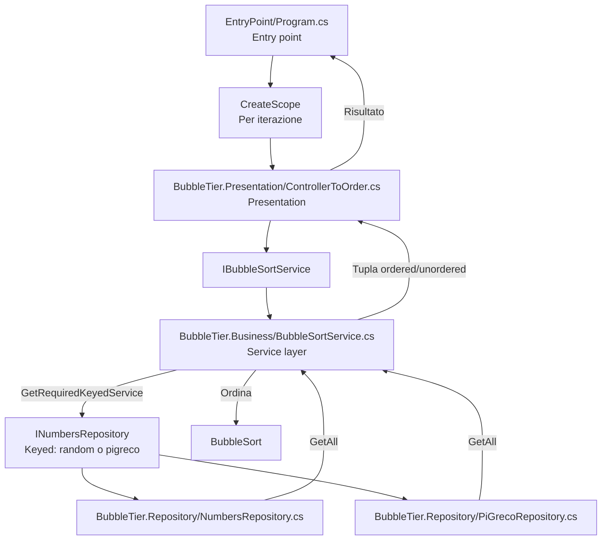

# BubbleTier

Console app che genera una sequenza di numeri casuali, la ordina con bubble sort e mostra a schermo sia i dati originali sia quelli ordinati. La struttura è separata a livelli: repository, service e controller, con `Program` come entry point.

## Struttura del progetto per fasi

1. **Entry point** (`EntryPoint/Program.cs`)  
   Avvio applicazione e composizione delle dipendenze.

2. **Presentation** (`BubbleTier.Presentation`)  
   Gestione input/output e coordinamento del flusso tramite il controller.

3. **Business** (`BubbleTier.Business`)  
   Logica di ordinamento e servizi applicativi.

4. **Repository** (`BubbleTier.Repository`)  
   Accesso ai dati (numeri casuali o cifre di PI).

## Struttura e interazione

## Dependency Injection

La configurazione avviene in `EntryPoint/Program.cs` usando `Host.CreateApplicationBuilder` e `IServiceCollection`:

- `INumbersRepository` è registrato come **keyed singleton**:
  - chiave `"random"` → `NumbersRepository`
  - chiave `"pigreco"` → `PiGrecoRepository`
- `IBubbleSortService` e `ControllerToOrder` sono registrati come **scoped** per creare una nuova istanza ad ogni iterazione del loop.

Flusso di risoluzione:

1. `Program` registra i servizi e costruisce l’host.
2. Per ogni scelta utente viene creato uno `scope` (`CreateScope()`).
3. Il container crea `ControllerToOrder` e inietta `IBubbleSortService`.
4. `BubbleSortService` risolve il repository corretto con `GetRequiredKeyedService` in base al valore di `Choice`.

## Dettaglio dei file

### `EntryPoint/Program.cs`
- **Responsabilità**: entry point e composizione delle dipendenze.
- **Interazioni**:
  - Registra `INumbersRepository` in base alla scelta (casuali o PI).
  - Registra `IBubbleSortService` e `ControllerToOrder`.
  - Chiama `GetOrderedNumbers()` sul controller e stampa i risultati.

### `BubbleTier.Presentation/ControllerToOrder.cs`
- **Responsabilità**: presentation layer che espone un metodo semplice per ottenere i dati ordinati.
- **Interazioni**:
  - Dipende da `IBubbleSortService`.
  - Restituisce la tupla con numeri ordinati e non ordinati.

### `BubbleTier.Business/BubbleSortService.cs`
- **Responsabilità**: logica di business per l’ordinamento.
- **Interazioni**:
  - Richiede i dati a `NumbersRepository`.
  - Ordina tramite `BubbleSort()` e restituisce ordered/unordered.

### `BubbleTier.Repository/NumbersRepository.cs`
- **Responsabilità**: accesso ai dati (generazione numeri casuali unici).
- **Interazioni**:
  - Fornisce i dati al service tramite `GetAll()`.

### `BubbleTier.Repository/PiGrecoRepository.cs`
- **Responsabilità**: accesso ai dati (cifre di PI).
- **Interazioni**:
  - Fornisce i dati al service tramite `GetAll()` quando l'utente sceglie PI.

### `BubbleTier.Business/ServiceInterfaces.cs`
- **Responsabilità**: definizione dei contratti del service layer.
- **Interazioni**:
  - Espone `IBubbleSortService` usato dal controller.

### `BubbleTier.Repository/RepoInterfaces.cs`
- **Responsabilità**: definizione dei contratti del repository layer.
- **Interazioni**:
  - Espone `INumbersRepository` usato dal service.

